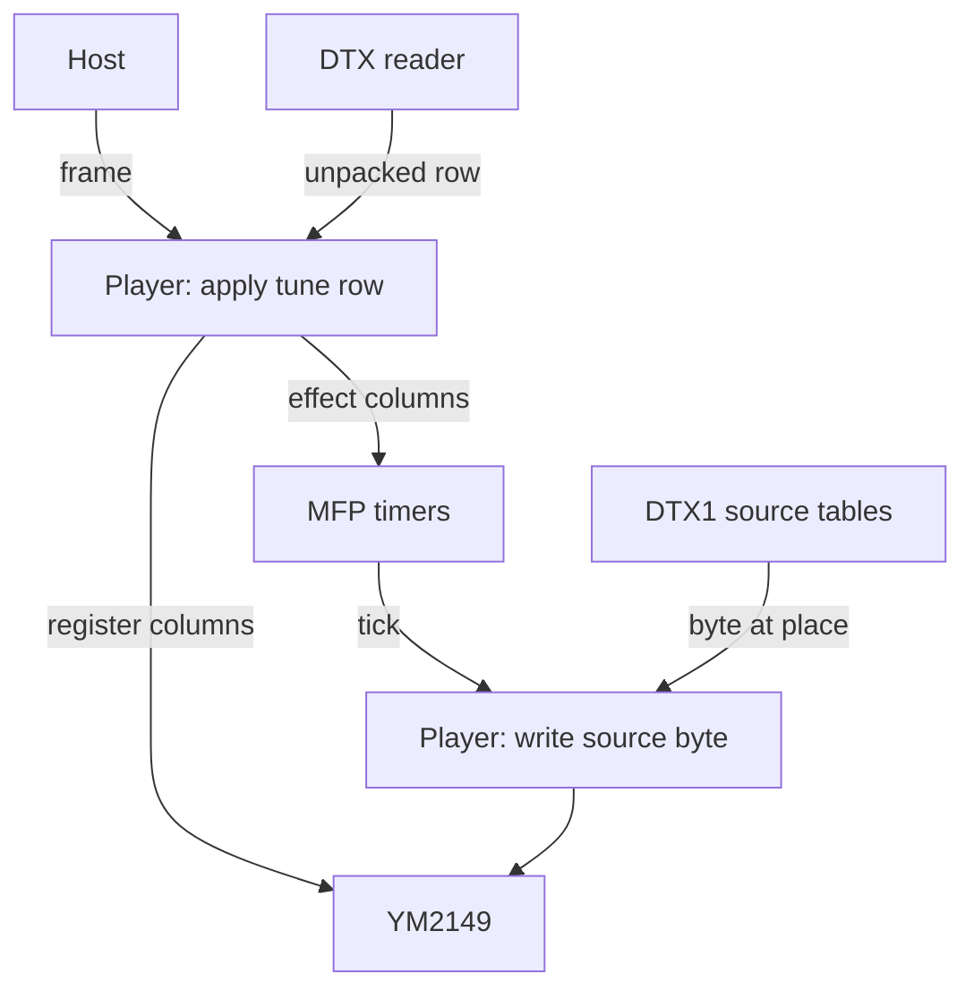

# YMXR - a chiptune format and player for the Atari ST

## Read this first

**AI wrote most of YMXR.** Claude (Anthropic's Claude Code) wrote the two
tool trees, the 68000 player and the two files around it, the tests, the
emulation rig and most of these documents. Robbert van Dalen directed the
work: he requested, read and merged every change. [LICENSE](LICENSE) sets
the terms, and its attribution records who did what. This section informs
the reader's decision to use software written this way.

YMXR builds on older work. DTX defines the table and the 68000 readers a
tool binds a tune with, and the ST4 compressor beneath DTX derives from
Einar Saukas's ZX1. Arnaud Carré defined the YM5 and YM6 register-dump
formats, and SNDH is the Atari ST scene's shared music container.

## What YMXR is

YMXR plays chiptunes on the Atari ST. It converts a YM dump, the sound
chip's registers recorded one frame at a time, into a tune file, and a
tune file into an SNDH file or a TOS program for an Atari ST or an
emulator. The 68000 player writes the YM2149 once a frame and runs effects
on the timers of the MC68901 (MFP) at rates above the frame rate.

The format encodes a YMXS tune as DTX tables and defines how each column
reaches the YM2149 or the MFP.

## Getting started

The [releases](https://github.com/odipar/YMXR/releases) ship the twelve
tools as executables for Windows, macOS and Linux, on x64 and arm64, one
zip a platform. This call makes a program that plays a dump:

```bash
ym-to-ymxs < tune.ym | ymxs-to-prg > TUNE.PRG
```

`TUNE.PRG` runs on an Atari ST or under Hatari, an Atari ST emulator, and
plays until SPACE or ESC. A checkout has the same tools under
[`bin/`](bin); [`ym/play.sh`](ym/play.sh) converts a dump and plays it
under Hatari in one call, and [`ym/test/`](ym/test) has eleven dumps to
try.

## Converting and playing

```bash
bin/ym-to-ymxr < tune.ym > tune.ymxr
bin/ymxr-sndh -t"The title" < tune.ymxr > tune.sndh
bin/ymxr-prg < tune.sndh > TUNE.PRG

bin/ym-to-ymxs < tune.ym | bin/ymxs-to-prg > TUNE.PRG
bin/ymxr-multi one.ymxr two.ymxr | bin/ymxr-sndh | bin/ymxr-prg > SET.PRG
bin/ymxr-set one.ym two.ym > SET.PRG
bin/ymxr-trace -r4 < tune.ymxr
ym/play.sh tune.ym
```

A tune file has tables alone. An SNDH file adds DTX's reader and the
player, and a TOS program plays the SNDH file on a bare machine.
[`bin/ymxr-set`](bin/ymxr-set) runs those calls over a set of dumps with
the Go tools ([tools.md](doc/tools.md) 16.6).

`ymxr-check` compares a converted tune with its dump, and `ymxr-trace`
prints the frame record the conformance kit uses. A tool writes its
output to standard output and its report to standard error; `-silent`
drops the report and the summary and keeps the output and the notes
([tools.md](doc/tools.md) 3.3).

## Words used here

| word | definition |
|---|---|
| YM dump | a YM5 or YM6 file: the registers of the YM2149, recorded one frame at a time |
| tune file | the values fixed for a tune, its name, its DTX2 table and one DTX1 table a source, in one file |
| SNDH file | tunes with DTX's reader and the player added, in SNDH, the Atari ST scene's shared music container |
| TOS program | an SNDH file behind a program stub, which runs on an Atari ST |
| player | the program that reads the tune's table one row a frame, writes the columns that row sets to the YM2149 and the MFP, and at each tick of a timer writes one row of its source |
| frame | one call of the player, at the tune's rate |
| tick | one interrupt of a timer, at the rate of an effect |
| conformance kit | the tune files under `doc/conformance/tunes`, each with its table unpacked beside it, that an independent reader is written against |

## Reading and playback

The host calls the player at the tune's frame rate. A frame applies an
unpacked row of the tune: the effect columns, then the register columns.
The MFP's interrupts run the tick at each effect's rate.



A tick writes a source byte through its target and advances the
*place*; at the marker on the last row it repeats the source or stops its
timer. [SPEC.md](doc/SPEC.md) sections 4 and 5 define the order and where
a tick may fall. A YMXR reader records the frames instead of writing the
chips, and its record leaves the ticks out (section 7).

## The documents

To write a player, start with [requirements.md](doc/requirements.md),
[SPEC.md](doc/SPEC.md) sections 1 to 5 and [BINARIES.md](doc/BINARIES.md);
to write a reader, SPEC.md sections 1 to 3 and 7, then the
[conformance kit](doc/conformance). Read SPEC.md beside
[YMXS's specification](https://github.com/odipar/YMXS/blob/main/doc/SPEC.md).

| document | contents |
|---|---|
| [requirements.md](doc/requirements.md) | format and repository requirements |
| [SPEC.md](doc/SPEC.md) | columns, frames, ticks, writer rules and reader output |
| [BINARIES.md](doc/BINARIES.md) | binary layouts, assembly and host calls |
| [doc/conformance/](doc/conformance) | independent reader tests |
| [writing.md](doc/writing.md) | producing tune files from a tracker or converter |
| [tools.md](doc/tools.md) | commands, flags, reports and exit codes |
| [ymxs.md](doc/ymxs.md) | conversion through YMXS |
| [glossary.md](doc/glossary.md) | term definitions |
| [terminology.md](doc/terminology.md) | chip and format terminology |
| [performance.md](doc/performance.md) | measured playback costs |
| [experiments.md](doc/experiments.md) | experiments and measurements |
| [plan.md](doc/plan.md) | estimated costs and possible reductions |
| [RELEASES.md](doc/RELEASES.md) | release history |

## What is here

| source | contents |
|---|---|
| [`src/main/java/org/ymxr/`](src/main/java/org/ymxr) | the twelve tools in Java, the reference: the converters, the check, the two records, the binder and the combiners |
| [`go/`](go) | the same twelve in Go, the executables a release ships |
| [`bin/`](bin) | the twelve as scripts, each writing standard output; ten read standard input, `ymxr-multi` and `ymxr-check` the files named ([tools.md](doc/tools.md) 1.1), and `ymxr-set` runs the calls of a whole set (16.6) |
| [`68k/YMXR.S`](68k/YMXR.S) | the player; `YMXR_PERF` builds the raster monitor in |
| [`68k/YMXR_sndh.S`](68k/YMXR_sndh.S), [`68k/YMXR_prg.S`](68k/YMXR_prg.S) | the SNDH core around the player and the program stub, assembled once and combined with a tune by a tool |
| [`ym/`](ym) | the measurement and play scripts ([tools.md](doc/tools.md) 18), and [`ym/test`](ym/test), eleven dumps the tests run on |
| [`release/`](release) | the scripts that build and list a release |

## Building and testing

The Java tree needs Java 23, Maven and rmac, with DTX and YMXS installed
in the local Maven repository by `mvn install` in each checkout. The Go
tree builds with `go build ./cmd/...` under [`go/`](go) and fetches its
modules ([tools.md](doc/tools.md) 19).

| what runs | what it reads |
|---|---|
| `mvn test` | document consistency and style; dump conversion and replay; conformance files byte for byte; assembled cores, stub, SNDH and PRG layouts; Java/Go parity |
| [`68k/test/emu/test_ymxr.py`](68k/test/emu/test_ymxr.py) | emulated 68000 frames, timer programming and ticks against the specification model; corpus and build flags in [tools.md](doc/tools.md) 17 |

## Related repositories

[YMXS](https://github.com/odipar/YMXS) defines the tune a YMXR tune file
encodes, and how it plays. [DTX](https://github.com/odipar/DTX) is the
table format: `R` rows and `C` columns, every value `W` bytes, in one of
three variants. [YMX](https://github.com/odipar/YMX), the family this
repository belongs to, is a design document of how YMXS, YMXR, DTX and ST4
fit together. It was a format and a player until 0.10.1, and YMXR
replaces both.
