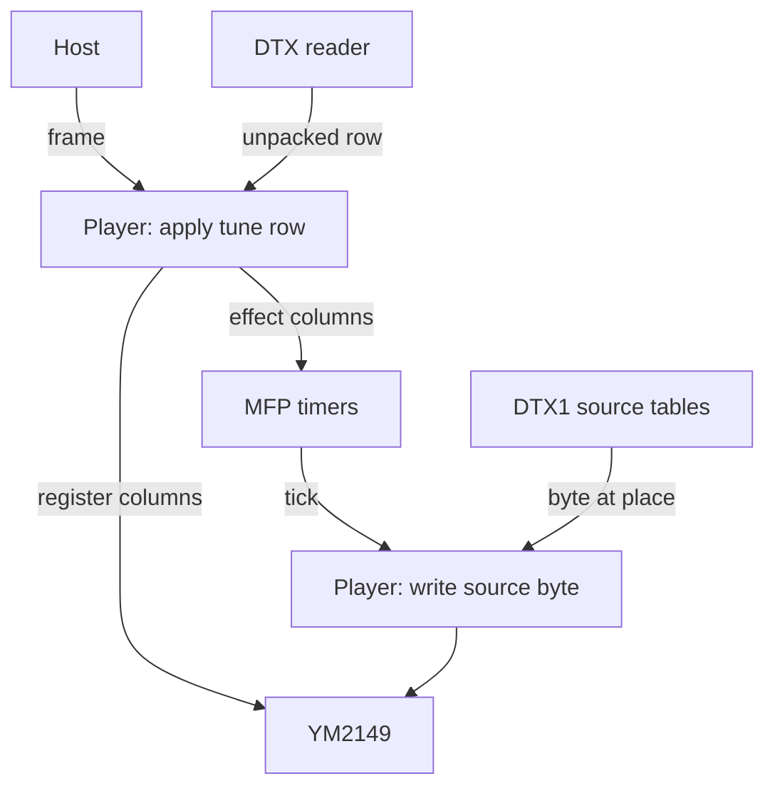

# YMXR

## Read this first

**AI wrote most of YMXR.** Claude (Anthropic's Claude Code) wrote the two
tool trees, the 68000 player and the two files combined around it, the
tests, the emulation rig and most of what is written here, under Robbert
van Dalen's direction: he requested, read and merged every change.
[LICENSE](LICENSE) is the terms, and its attribution records who did what.
Whether to use software written that way is the reader's decision, and
this section is here so that the decision is informed.

What it is built on is older than it. DTX defines the table and the 68000
readers a tool binds a tune with, and the ST4 compressor beneath DTX
derives from Einar Saukas's ZX1. The YM5 and YM6 register-dump formats are
Arnaud Carré's, and SNDH is the Atari ST scene's shared music container.

## What YMXR is

YMXR is a chiptune format and 68000 player for the Atari ST. It replaces
[YMX](https://github.com/odipar/YMX) and encodes YMXS tune data in DTX
tables. Each repository defines a layer:

- **[DTX](https://github.com/odipar/DTX)** defines table layout, packing
  and 68000 readers. Values have a fixed width; tables repeat from a
  selected row or play once.
- **[YMXS](https://github.com/odipar/YMXS)** defines tune data and playback:
  register rows, effects, sources and rates. Every conversion here passes
  through this structure, which a tracker can emit as JSON.
- **YMXR** encodes the structure as DTX tables and defines how each column
  reaches the YM2149 sound chip or MC68901 (MFP) timers.

## Reading and playback

The host calls the player at the tune's frame rate. Each frame applies
an unpacked tune row: effect columns first, then register columns. MFP
interrupts run the tick procedure at each effect's rate.



A tick writes a source byte through its target. It advances the *place*,
or, at the marker on the last row, repeats the source or stops its timer.
[SPEC.md](doc/SPEC.md) sections 4 and 5 define the order and interrupt
boundaries. A YMXR reader records frames instead of writing to the chips;
its record excludes ticks (section 7).

## The documents

For a player, begin with requirements, SPEC.md sections 1 to 5 and
BINARIES.md. For a reader, use SPEC.md sections 1 to 3 and 7, then the
conformance kit. Read SPEC.md with [YMXS's specification](https://github.com/odipar/YMXS/blob/main/doc/SPEC.md).

| document | contents |
|---|---|
| [requirements.md](doc/requirements.md) | format and repository requirements |
| [SPEC.md](doc/SPEC.md) | columns, frames, ticks, writer rules and reader output |
| [BINARIES.md](doc/BINARIES.md) | binary layouts, assembly and host calls |
| [doc/conformance/](doc/conformance) | independent reader tests |
| [writing.md](doc/writing.md) | producing tune files from a tracker or converter |
| [tools.md](doc/tools.md) | commands, flags, reports and exit codes |
| [ymxs.md](doc/ymxs.md) | conversion through YMXS |
| [glossary.md](doc/glossary.md) | term definitions |
| [terminology.md](doc/terminology.md) | chip and format terminology |
| [performance.md](doc/performance.md) | measured playback costs |
| [experiments.md](doc/experiments.md) | experiments and measurements |
| [plan.md](doc/plan.md) | estimated costs and possible reductions |
| [RELEASES.md](doc/RELEASES.md) | release history |

## What is here

| source | contents |
|---|---|
| [`src/main/java/org/ymxr/`](src/main/java/org/ymxr) | the thirteen tools in Java, the reference: the converters, the check, the trace, the binder and the combiners |
| [`go/`](go) | the same thirteen in Go, the executables a release ships |
| [`bin/`](bin) | the thirteen as scripts, each writing standard output; eleven read standard input, `ymxr-multi` and `ymxr-check` the files named ([tools.md](doc/tools.md) 1.1) |
| [`68k/YMXR.S`](68k/YMXR.S) | the player; `YMXR_PERF` builds the raster monitor in |
| [`68k/YMXR_sndh.S`](68k/YMXR_sndh.S), [`68k/YMXR_prg.S`](68k/YMXR_prg.S) | the SNDH core around the player and the program stub, assembled once and combined with a tune by a tool |
| [`ym/`](ym) | the measurement and play scripts ([tools.md](doc/tools.md) 19), and [`ym/test`](ym/test), ten dumps the tests run on |
| [`ymx/`](ymx) | a YMX file converted and played, and [`ymx/test`](ymx/test), four tunes read from YMX files alone |
| [`release/`](release) | the scripts that build and list a release |

## Converting and playing

```bash
bin/ym-to-ymxr < tune.ym > tune.ymxr
bin/ymxr-sndh -t"The title" < tune.ymxr > tune.sndh
bin/ymxr-prg < tune.sndh > TUNE.PRG

bin/ym-to-ymxs < tune.ym | bin/ymxs-to-prg > TUNE.PRG
bin/ymxr-multi one.ymxr two.ymxr | bin/ymxr-sndh | bin/ymxr-prg > SET.PRG
bin/ymxr-trace -r4 < tune.ymxr
ym/play.sh tune.ym
```

A tune file contains tables. An SNDH file adds DTX's reader and the
player; a TOS program plays that SNDH file on a bare machine.
`ym/play.sh` runs the conversion and Hatari.

`ymxr-check` compares a converted tune with its dump. `ymxr-trace`
prints the frame record used by the conformance kit. Tools write output
to standard output and reports to standard error; `-silent` omits the
report and summary but preserves output and notes ([tools.md](doc/tools.md) 3.3).

## Building and testing

Java 23, Maven and rmac, with DTX and YMXS installed in the local Maven
repository by `mvn install` in each checkout. The Go tree builds with
`go build ./cmd/...` under [`go/`](go) and fetches its modules
([tools.md](doc/tools.md) 20).

| what runs | what it reads |
|---|---|
| `mvn test` | document consistency and style; dump conversion and replay; conformance files byte for byte; assembled cores, stub, SNDH and PRG layouts; Java/Go parity |
| [`68k/test/emu/test_ymxr.py`](68k/test/emu/test_ymxr.py) | emulated 68000 frames, timer programming and ticks against the specification model; corpus and build flags in [tools.md](doc/tools.md) 18 |
| [`ym/parity.py`](ym/parity.py) | YMX and YMXR register writes compared frame by frame under Hatari |
